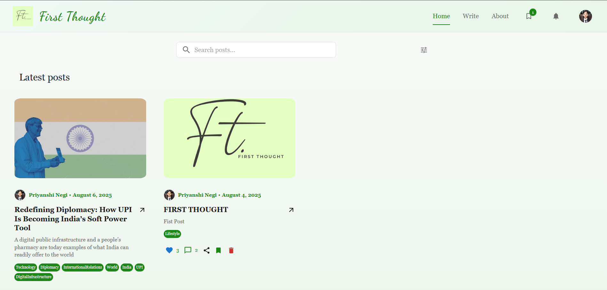
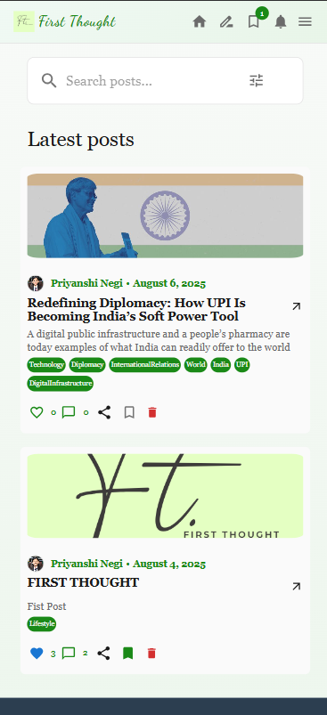

# FirstThought - Blog Platform

A modern full-stack blogging platform where users can share their thoughts, discover content, and engage with a community of writers.

## ✨ Features

### 🔐 Authentication & Profiles
- Secure JWT authentication with HTTP-only cookies
- User registration and login
- Profile management with avatar uploads
- Email verification system

### ✍️ Content Creation & Management
- Rich text editor for creating blog posts
- Image upload support with local storage
- Post preview functionality
- Edit and delete your own posts
- Tag-based content organization

### 🌐 Social Features
- Like and unlike posts
- Comment system with threaded discussions
- Save posts for later reading
- User profiles showing authored posts and saved content

### 🔍 Discovery & Search
- Search posts by title, content, and preview
- Filter posts by topics/tags
- Pagination for smooth browsing
- Topic-based content filtering

### 📧 Newsletter System
- Email newsletter subscription
- Subscription management from user profiles
- Email notifications for subscribers
- Unsubscribe functionality

### 📱 Modern Experience
- Progressive Web App (PWA) support
- Fully responsive design
- Optimistic UI updates with React Query
- Real-time notifications

## 🛠️ Tech Stack

### Frontend
- **React 18** with TypeScript
- **Vite** for build tooling
- **Material-UI (MUI)** for components
- **Redux Toolkit** for authentication state
- **React Query** for server state management
- **React Hook Form** for form handling
- **React Router** for navigation

### Backend
- **Node.js** with Express and TypeScript
- **Prisma** ORM with SQLite (development) / PostgreSQL (production)
- **JWT** for authentication
- **Multer** for file uploads with local storage
- **Nodemailer** for email services
- **Base64** image encoding for storage


### Desktop View (Alternative)



### Mobile View



## 🚀 Getting Started

### Prerequisites
- Node.js 18+
- SQLite (development) or PostgreSQL (production)

### Installation

1. **Clone the repository**
```bash
git clone <your-repo-url>
cd firstthought-blog
```

2. **Install dependencies**
```bash
npm run postinstall
```

3. **Environment Setup**
Create `.env` file in root directory:
```bash
# Server
PORT=3000

# Database (SQLite for development)
DATABASE_URL="file:./dev.db"

# Authentication
TOKEN_SECRET="your-jwt-secret-key"

# Email (for newsletter)
EMAIL_USER="your-email@gmail.com"
EMAIL_PASS="your-app-password"

# Production URLs
FRONTEND_SERVER_PROD="https://your-frontend-domain.com"
VITE_BACKEND_SERVER_PROD="https://your-backend-domain.com"
```

4. **Database Setup**
```bash
cd backend
npx prisma migrate dev
npm run seed  # Optional: add sample data
```

5. **Start Development**
```bash
npm run dev
```

Access the app at `http://localhost:5173`

## 📁 Project Structure

```
├── frontend/                 # React TypeScript application
│   ├── src/
│   │   ├── features/        # Feature modules
│   │   │   ├── auth/        # Authentication
│   │   │   ├── posts/       # Blog posts
│   │   │   ├── comments/    # Comments
│   │   │   ├── users/       # User profiles
│   │   │   ├── search/      # Search functionality
│   │   │   └── misc/        # Pages (Home, About, etc.)
│   │   ├── components/      # Shared components
│   │   └── app/            # App configuration
│   └── public/             # PWA assets
├── backend/                 # Express TypeScript API
│   ├── src/
│   │   ├── controllers/    # Route handlers
│   │   ├── routes/         # API routes
│   │   ├── middleware/     # Custom middleware
│   │   ├── config/         # Database config
│   │   └── utils/          # Utilities (email service)
│   ├── prisma/             # Database schema
│   └── uploads/            # Local file storage
└── package.json            # Workspace configuration
```

## 🔧 Available Scripts

### Root
- `npm run dev` - Start both frontend and backend
- `npm run postinstall` - Install all dependencies

### Backend
- `npm run dev` - Development server
- `npm run start` - Production server
- `npm run seed` - Seed database

### Frontend
- `npm run dev` - Development server
- `npm run build` - Production build
- `npm run preview` - Preview build

## 🚀 Deployment

### Frontend (Vercel)
- Build command: `cd frontend && npm run build`
- Output directory: `frontend/dist`

### Backend (Railway/Render)
- Build command: `cd backend && npm install && npx prisma generate`
- Start command: `cd backend && npm start`
- Note: For production, switch to PostgreSQL in DATABASE_URL

### File Storage
Images are stored as base64 strings in the database, making deployment simpler without external storage services.

## 📱 PWA Features

- Offline support
- Install prompt
- App-like experience on mobile

## 🤝 Contributing

1. Fork the repository
2. Create feature branch (`git checkout -b feature/name`)
3. Commit changes (`git commit -m 'Add feature'`)
4. Push to branch (`git push origin feature/name`)
5. Open Pull Request

## 📄 License

MIT License - see [LICENSE](LICENSE) file for details.# FirstThought - Blog Platform

A modern full-stack blogging platform where users can share their thoughts, discover content, and engage with a community of writers.

